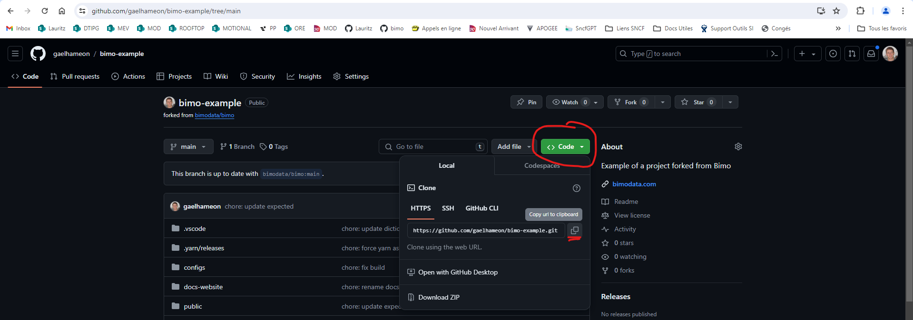

# Installation

Les *packages* Bimo ne sont pour le moment pas publiés sur [npm](https://www.npmjs.com/), tout simplement parce que ce n'est pas utile pour le moment. Bimo est un [*monorepo*](https://en.wikipedia.org/wiki/Monorepo) et tous les projets qui utilisent Bimo actuellement sont des *fork* du *monorepo* public. Dès qu'une demande existera, nous commencerons à publier les *packages* sur npm. N'hésitez pas à nous le demander ! En attendant, pour utiliser des packages Bimo, le meilleur moyen est de faire votre propre *fork*.

Si vous êtes un développeur expérimenté à l'aise avec l'écosystème Node.js/JavaScript, les instructions sommaires ci-dessous devraient suffire. Sinon, poursuivez la lecture avec les instructions détaillées. 

## Instructions sommaires

- Faire un *fork* et/ou cloner le dépôt sur votre ordinateur
- Faire `yarn install`

:::info

Nous utilisons [`yarn`](https://yarnpkg.com/getting-started) plutôt que `npm` comme package manager, notamment pour la gestion des *workspaces*. Vous pouvez essayer d'utiliser un autre package manager de votre choix, mais cela demandera probablement certains ajustements.

:::

- Faire `yarn build:all` pour compiler les packages écrits en TypeScript
- Faire `yarn test` (ou `npm run test`) pour lancer les tests automatisés - s'ils se complètent avec succès, tout va bien !

## Instructions détaillées

### Pré-requis

- Installer [git](https://www.git-scm.com/downloads)
- Installer [Node.js](https://nodejs.org/en)
- Installer un éditeur de code de votre choix. Nous recommandons [Visual Studio Code](https://code.visualstudio.com/)

### *Forker* le dépôt et récupérer l'URL

À partir de la [page GitHub](https://github.com/bimodata/bimo) du projet, cliquez sur le bouton Fork et suivez les instructions pour créer une *fork* qui sera associée à votre compte GitHub. 


Récupérez ensuite l'url de votre *fork*: 



:::note

Si vous ne voulez pas créer un compte GitHub, vous pouvez simplement utiliser directement l'URL du dépôt public : `https://github.com/bimodata/bimo.git`. Notez toutefois qu'il sera alors plus compliqué de renvoyer votre code modifié vers GitHub pour le sauvegarder ou le partager avec d'autres utilisateurs.

:::


### Cloner le dépôt sur votre ordinateur

Pour cette étape, vous devrez avoir accès à une fenêtre de *terminal*. Il existe plusieurs options, mais nous allons ici utiliser le terminal intégré à Visual Studio Code. 

- Lancez Visual Studio Code
- Si le terminal n'est pas visible, utilisez le menu `Affichage > Terminal` ou `View > Terminal` ou `Terminal > New Terminal` pour faire apparaître le terminal intégré.


Le terminal s'ouvre dans la partie inférieure de la fenêtre et le dossier courant est celui correspondant à votre nom d'utilisateur:


- Naviguez dans ce terminal jusqu'à un dossier où vous voudriez stocker vos projets de développement. Si vous n'en avez pas, vous pouvez par exemple créer un dossier `dev`: 

```bash
mkdir dev
cd dev
```

:::info

La commande `mkdir` (pour make directory) créé un sous-dossier dans le dossier courant.

 La commande `cd` (change directory) navigue vers le dossier indiqué. 

:::


- Utilisez la commande `git clone` avec l'URL récupérée à l'étape précédente pour cloner le dépôt

```bash
git clone https://github.com/gaelhameon/bimo-example.git
```

Le dépôt est alors cloné vers un sous-dossier dont le nom correspond au nom du dépôt (bimo-example dans cet exemple).

- Utilisez la commande `code <chemin vers le dossier>` pour ouvrir le sous-dossier dans une nouvelle fenêtre Visual Studio Code.

```bash
code .\bimo-example\
```

Vous devriez voir une nouvelle fenêtre avec l'arborescence de fichier du projet dans la partie gauche: 


### Installer les dépendances

:::warning

Au moment d'écrire ces lignes, je ne sais plus s'il faut toujours installer Yarn globalement avant de pouvoir utiliser les versions "locales" incluses dans les projets. Si les commandes ci-dessous ne fonctionnent pas essayez d'abord la commande `npm install -g yarn` et/ou suivez les [instructions d'installation de Yarn](https://yarnpkg.com/getting-started/install)

:::

Lancez la commande 

```bash
yarn install
```

 et patientez ... L'installation devrait se terminer avec une ligne ressemblant à  
 
 ```bash
 ➤ YN0000: · Done with warnings in 35s 105ms
 ```


### Compiler les packages TypeScript

Lancez la commande 
```bash
yarn build:all
```
 et patientez. La compilation devrait se terminer avec une ligne ressemblant à 
 
 ```bash
 Done in 26s 172ms
 ```

### Lancer les tests unitaires

Lancez la commande 

```bash
npm run test
```

 et patientez. Les tests devraient se terminer avec des lignes ressemblant à 


```
  426 passing (2s)
  5 pending
```

Si les tests ont fonctionné c'est un bon signe que tout s'est installé correctement !


### Créer votre premier script

- Créez un fichier `script-test.js` à la racine du projet. Copiez les lignes suivantes dans ce fichier: 

```javascript title='script-test.js'
const { VehicleSchedule } = require('@bimo/core-entities');

const myVsc = new VehicleSchedule({
  vscIntId: 0,
  vscName: 'Test',
  vscDescription: 'Un horaire de test',
});

console.log(myVsc.longLoggingOutput);
```

Lancez la commande ci-dessous: 

```bash
node ./script-test.js
```

Vous devriez voir cette ligne: 

```bash
0: Test - Un horaire de test (6) | 0 trips | 0 blocks
```