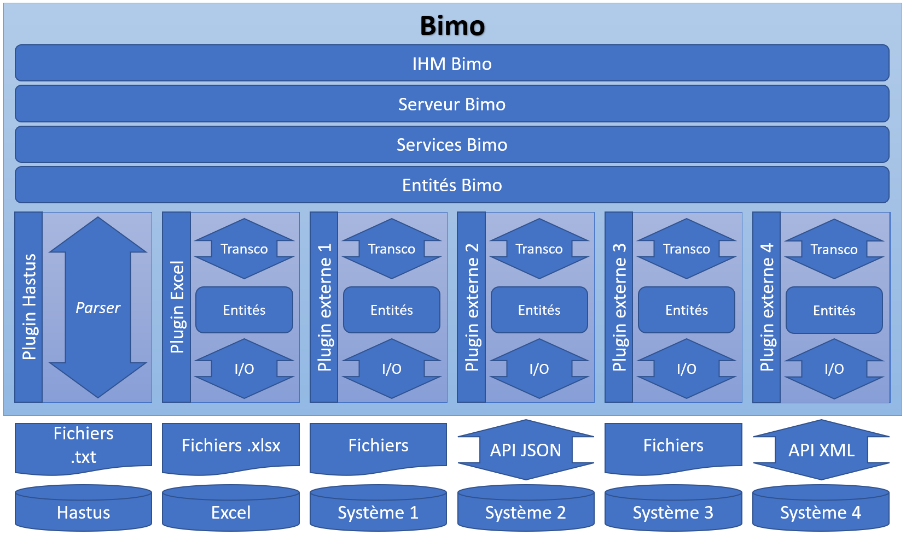

# Introduction

Le projet Bimo regroupe un ensemble de briques logicielles permettant d'accélérer le développement de scripts ou d'applications traitant des données de transport collectif.

Bimo a initialement été développé en parallèle de projets d'implantation du progiciel [Hastus](https://www.giro.ca/fr-fr/nos-solutions/logiciel-hastus/) chez SNCF et est graduellement mis en Open Source. 

Le produit utilisé chez SNCF prend la forme d'une IHM React à partir de laquelle les utilisateurs peuvent sélectionner des données, paramétrer les transformations à opérer sur ces données et lancer des traitements, qui sont alors exécutés par un serveur Node.js. Plusieurs plugins permettent de traiter des données de sources et de formats différents. L'architecture globale du projet est décrite dans le schéma ci-dessous:

Dans un premier temps, les entités et les services sont mis en Open Source sous la forme de plusieurs modules javascript indépendants et isomorphes. À vous d'identifier ceux qui peuvent vous être utiles et de les importer où bon vous semble !

