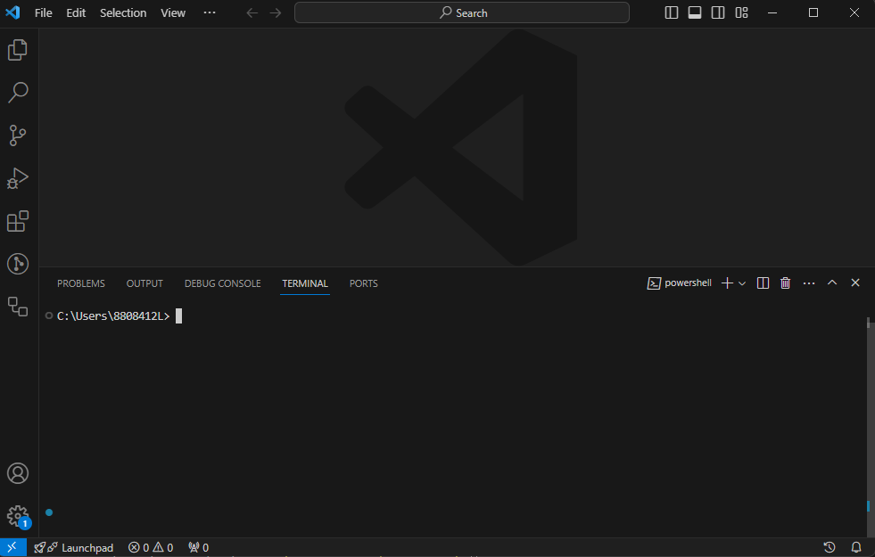

# Installation

Bimo packages are not currently published on [npm](https://www.npmjs.com/) simply because it is not necessary at this time. Bimo is a [monorepo](https://en.wikipedia.org/wiki/Monorepo), and all projects currently using Bimo are forks of the public monorepo. Once there is demand, we will start publishing the packages on npm. Feel free to ask us! In the meantime, to use Bimo packages, the best way is to create your own fork.

If you are an experienced developer comfortable with the Node.js/JavaScript ecosystem, the summary instructions below should suffice. Otherwise, continue reading the detailed instructions.

## Summary instructions

- Fork and/or clone the repository to your computer
- Run `yarn install`

:::info

We use [`yarn`](https://yarnpkg.com/getting-started) rather than `npm` as a package manager, particularly for workspace management. You can try using another package manager of your choice, but it will likely require some adjustments.

:::

- Run `yarn build:all` to compile the packages written in TypeScript
- Run `yarn test` (or `npm run test`) to execute automated tests - if they pass, everything is working fine!

## Detailed Instructions

### Prerequisites

- Install [git](https://www.git-scm.com/downloads)
- Install [Node.js](https://nodejs.org/en)
- Install a code editor of your choice. We recommend [Visual Studio Code](https://code.visualstudio.com/)

### Fork the Repository and Get the URL

From the project's [GitHub page](https://github.com/bimodata/bimo), click the Fork button and follow the instructions to create a fork associated with your GitHub account.


Then retrieve the URL of your fork:


:::note

If you don't want to create a GitHub account, you can simply use the public repository URL directly: `https://github.com/bimodata/bimo.git`. However, note that it will be more complicated to push your modified code back to GitHub for saving or sharing with other users.

:::

### Clone the repository to your computer

For this step, you will need access to a terminal window. There are several options, but we will use the integrated terminal in Visual Studio Code.

- Launch Visual Studio Code
- If the terminal is not visible, use the menu `View > Terminal` or `Terminal > New Terminal` to open the integrated terminal.


The terminal opens at the bottom of the window, and the current folder is your username's folder:



- Navigate in this terminal to a folder where you want to store your development projects. If you don't have one, you can create a `dev` folder:

```bash
mkdir dev
cd dev
```

:::info

The `mkdir` command (make directory) creates a subfolder in the current folder.

The `cd` command (change directory) navigates to the specified folder.

:::

- Use the `git clone` command with the URL obtained in the previous step to clone the repository:

```bash
git clone https://github.com/gaelhameon/bimo-example.git
```

The repository is then cloned into a subfolder named after the repository (bimo-example in this example).

- Use the `code <path to folder>` command to open the subfolder in a new Visual Studio Code window:

```bash
code .\bimo-example\
```

You should see a new window with the project file structure on the left side:


### Install Dependencies

:::warning

As of this writing, I am not sure if you still need to install Yarn globally before using the "local" versions included in projects. If the commands below do not work, first try the command `npm install -g yarn` and/or follow the [Yarn installation instructions](https://yarnpkg.com/getting-started/install).

:::

Run the command:

```bash
yarn install
```

and wait... The installation should end with a line resembling:

```bash
➤ YN0000: · Done with warnings in 35s 105ms
```

### Compile TypeScript Packages

Run the command:

```bash
yarn build:all
```

and wait. The compilation should end with a line resembling:

```bash
Done in 26s 172ms
```

### Run Unit Tests

Run the command:

```bash
npm run test
```

and wait. The tests should end with lines resembling:

```bash
426 passing (2s)
5 pending
```

If the tests worked, it's a good sign that everything installed correctly!

### Create Your First Script

- Create a `script-test.js` file at the root of the project. Copy the following lines into this file:

```javascript title='script-test.js'
const { VehicleSchedule } = require('@bimo/core-entities');

const myVsc = new VehicleSchedule({
  vscIntId: 0,
  vscName: 'Test',
  vscDescription: 'A test schedule',
});

console.log(myVsc.longLoggingOutput);
```

Run the command below:

```bash
node ./script-test.js
```

You should see this line:

```bash
0: Test - A test schedule (6) | 0 trips | 0 blocks
```