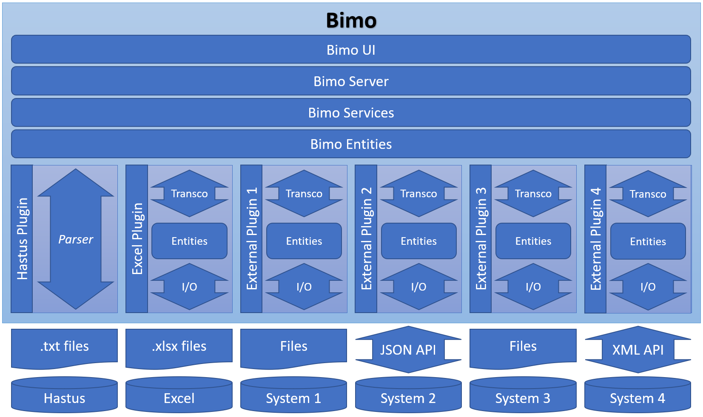

# Introduction

The Bimo project is a set of software components designed to accelerate the development of scripts or applications that process public transportation data.

Bimo was initially developed alongside the implementation of the [Hastus](https://www.giro.ca/en-ca/our-solutions/hastus-software/) software at SNCF and is gradually being made Open Source.

The product used at SNCF takes the form of a React UI through which users can select data, configure the transformations to be applied to this data, and launch processing tasks, which are then executed by a Node.js server. Several plugins allow for the processing of data from various sources and formats. The overall architecture of the project is described in the diagram below:

For the first step of the process, the entities and services are made Open Source in the form of several independent and isomorphic JavaScript packages. It's up to you to identify the ones that can be useful to you and to import them wherever you see fit!

